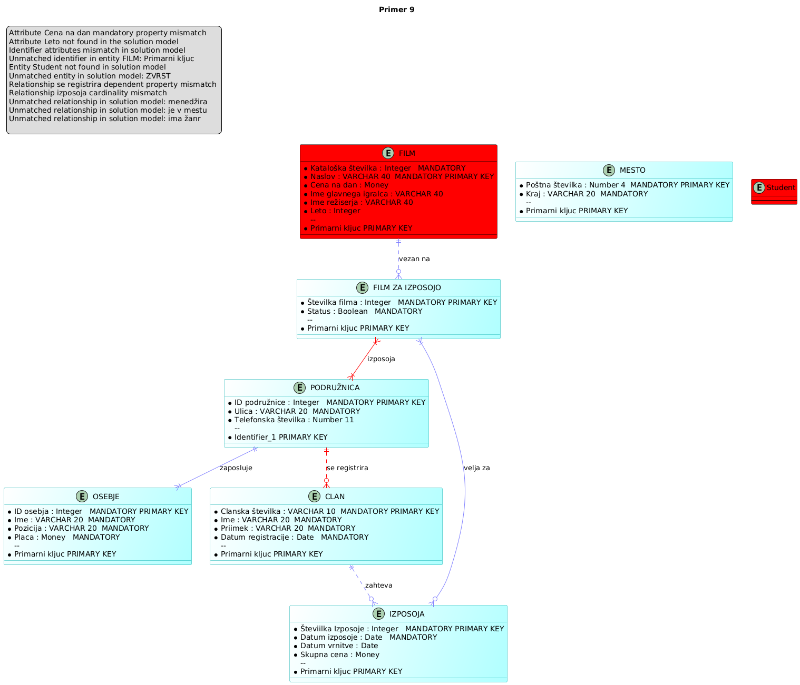

# CDM-validator
Created as a part of my undergraduate diploma thesis.

## 1. Description
This compiler is a part of my CS Undergraduate diploma thesis, in which
I attempt to automate the validation of conceptual data models.
The validator can read .cdm files, created in PowerDesigner, and uses PlantUML for visualization of the model. The model is validated by being compared to a solution model.

## 2. Running and requirements
To run this project, simply run the App.py file.
Tool was written and tested with Python 3.12, and uses a [plantuml
0.3.0](https://pypi.org/project/plantuml/) library which also requires an internet connection to work properly.

## 2. Example results

